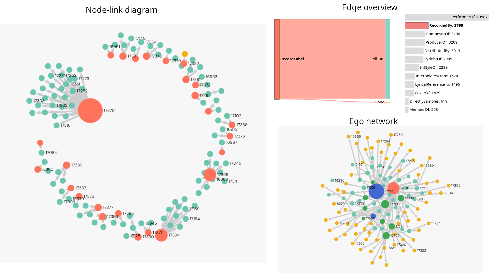
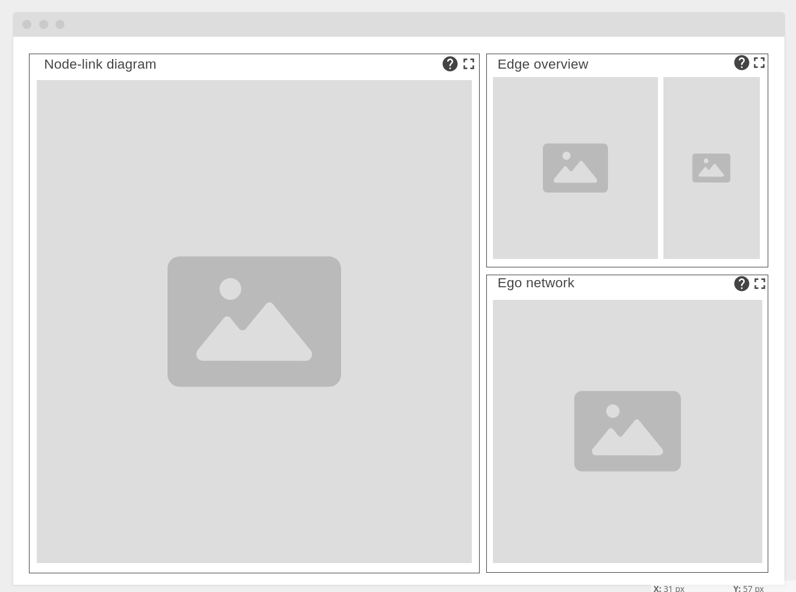
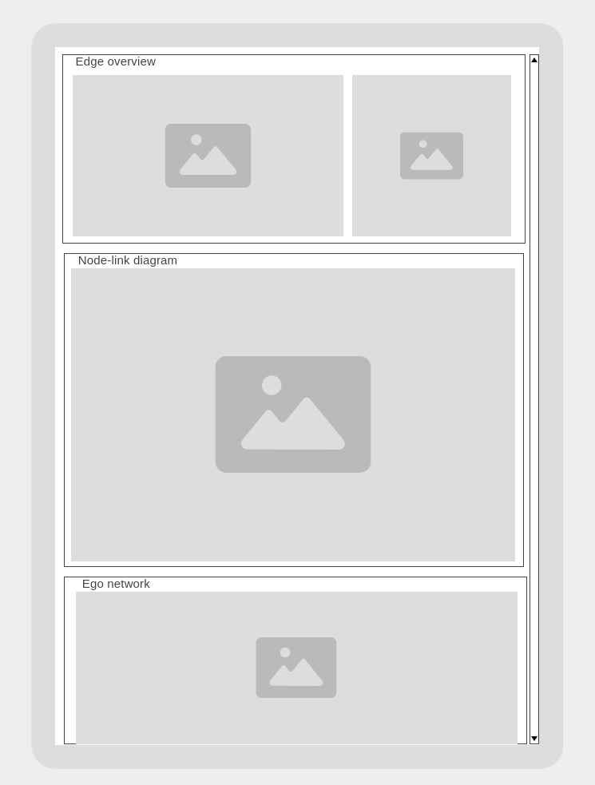

# Meeting notes

## Home view visualization grid
The general idea of the proposed design is to have 3 panels with linked interactive visualizations.

The image shows the state of the UI during a possible analysis performed on the MC1 graph of the 2025 VAST Challenge.
Namely, the user has detected the possible semantic incongruence of a group of edges of type `RecordedBy` with source of type `RecordLabel` and is analyzing the nodes involved.

1. **Edge overview** visualizes volume of flows between node types in the knowledge graph. It has affordances that allow the user to filter down the edges by edge type, source node type and target node type.

2. **Node-link diagram** visualizes the subgraph induced on the current selection performed on the edge overview. Allows the user to select a node for the ego network visualization. **Limitations**: In order to mitigate the hairball problem of visualizing large graphs, it has been suggested filter the visualization to the top $n$ nodes by degree (with $n$ to be determined). Obviously this should be clearly communicated to the user.

3. **Ego network** visualizes the immediate context of a node (the "Ego") selected from the node-link diagram. The ego network is extracted from the original graph (not the induced subgraph), meaning that all node and edge types are present.

This is the new proposed grid for the home view:

Since the normal workflow would go like this:
1. Filter to an interesting selection of edges using **edge overview**: in the example, the user selected edges of type `RecordedBy` and refined their selection to only those having `RecordLabel` as source;
2. Inspect **node-link diagram** and select ego: in the example, the user selected node `17370`, which is the largest hub in the subgraph ;
3. Inspect **ego network**.

It would probably make sense, for smaller screens, to reflow the layout like this (with **edge overview** as the first panel).

## Home view shared state
At least the following information should be shared among the visualizations of the home view (thus they should reside in the home view component):

- Edge type filter
- Source node type filter
- Target node type filter
- Selected node

It has been suggested that hovered on edge type would also be nice to have, in order to highlight edges in the ego network.

Also, all visualizations (not only in the home view) should share the same color scale for node types.

## Filter history
It has been suggested that it would be nice to preserve a history of the applied filters (arguably, this also makes sense for the selected node).

I am not extremely knowledgeable in Single Page Applications, but I suppose the way to go (or one way, at any rate) would be to leverage the router and query parameters to keep track of the UI state and assure backward/forward navigation correctness.

So, for example, for the described workflow, we would have something like the following sequence of routes:
1. `http://localhost:5173/`
2. `http://localhost:5173/?EdgeType=RecordedBy`
3. `http://localhost:5173/?EdgeType=RecordeBy&SourceType=RecordLabel`
4. `http://localhost:5173/?EdgeType=RecordedBy&SourceType=RecordLabel&SelectedNode=17370`